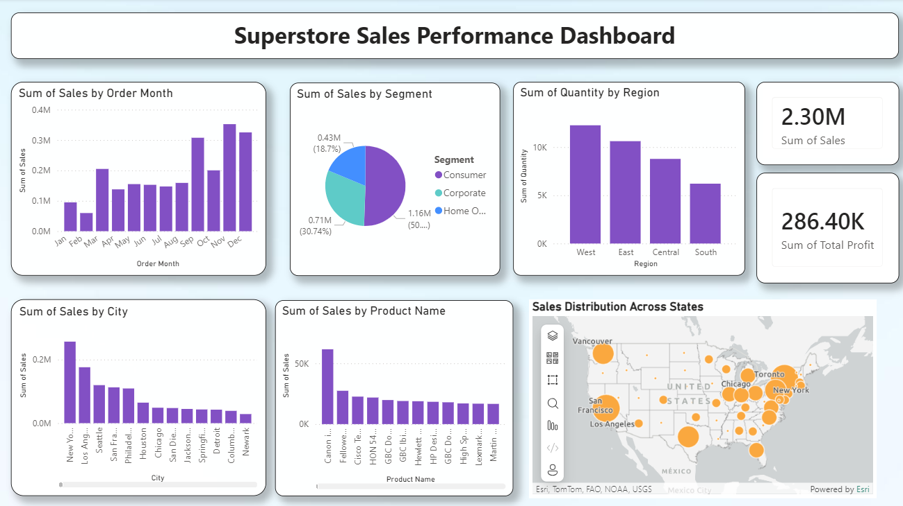

# Superstore Sales Analytics Dashboard


## Project Overview

This project performs **Data Cleaning**, **Exploratory Data Analysis (EDA)**, **SQL Analysis**, and **Power BI Dashboard** development using the Superstore Sales dataset.

## Objectives

- Prepare a clean, analysis-ready dataset (duplicates, missing values, date standardization)
- Validate core business KPIs via SQL (Sales, Profit, Quantity, Orders)
- Identify key patterns across regions, categories, customers, products, and discounting
- Deliver an interactive Power BI dashboard for decision-making

## Tools Used

- Microsoft Excel
- PostgreSQL (pgAdmin4)
- SQL
- Power BI
- GitHub

## Dataset Information

- **Dataset:** Superstore Sales Dataset
- **Records:** 9,994
- **Columns:** 22
- **Source file:** `Dataset/Sample_Superstore.csv`

## Methodology

1. **Data Cleaning (Excel / SQL-ready prep)**
2. **EDA** (distribution checks, trends, segmentation across Region/Category)
3. **SQL analysis** (KPI validation + breakdown queries)
4. **Power BI dashboard** (KPI cards + slicers + charts)

## Data Cleaning

- Removed duplicates
- Checked missing values
- Standardized date formats
- Verified data consistency

## KPI Metrics

| Metric | Value |
| --- | ---: |
| Total Sales | 2,297,200.86 |
| Total Profit | 286,397.02 |
| Total Quantity Sold | 37,873 |
| Total Orders | 9,994 |

## SQL Analysis

> SQL script: `SQL/sql_queries.sql`  \
> Reference outputs: `Results/sql_query_outputs.md`

### Query 1: Total Records

```sql
SELECT COUNT(*) AS total_records FROM sales;
```

**Output:** `9994`

### Query 2: Total Sales

```sql
SELECT ROUND(SUM(sales),2) AS total_sales FROM sales;
```

**Output:** `2297200.86`

### Query 3: Total Profit

```sql
SELECT ROUND(SUM(profit),2) AS total_profit FROM sales;
```

**Output:** `286397.02`

### Query 4: Total Quantity

```sql
SELECT SUM(quantity) AS total_quantity FROM sales;
```

**Output:** `37873`

### Query 5: Sales by Region

```sql
SELECT region, ROUND(SUM(sales),2) AS total_sales
FROM sales
GROUP BY region
ORDER BY total_sales DESC;
```

**Output:**

| Region | Total Sales |
| --- | ---: |
| West | 725,457.82 |
| East | 678,781.24 |
| Central | 501,239.89 |
| South | 391,721.91 |

### Query 6: Profit by Category

```sql
SELECT category, ROUND(SUM(profit),2) AS total_profit
FROM sales
GROUP BY category
ORDER BY total_profit DESC;
```

**Output:**

| Category | Total Profit |
| --- | ---: |
| Technology | 145,454.95 |
| Office Supplies | 122,490.80 |
| Furniture | 18,451.27 |

### Query 7: Top Customers

```sql
SELECT customer_name, ROUND(SUM(sales),2) AS total_sales
FROM sales
GROUP BY customer_name
ORDER BY total_sales DESC
LIMIT 10;
```

**Insight:** Identified highest revenue-generating customers.

### Query 8: Top Products

```sql
SELECT product_name, ROUND(SUM(sales),2) AS total_sales
FROM sales
GROUP BY product_name
ORDER BY total_sales DESC
LIMIT 5;
```

**Insight:** Identified best-selling products.

### Query 9: Discount Impact on Profit

```sql
SELECT discount, ROUND(AVG(profit),2) AS avg_profit
FROM sales
GROUP BY discount
ORDER BY discount;
```

**Insight:** Higher discounts generally reduce profitability.

## Power BI Dashboard

The dashboard is designed to support quick performance monitoring and drill-down analysis. It includes:

- Total Sales KPI Card
- Total Profit KPI Card
- Total Orders KPI Card
- Sales by Region Bar Chart
- Monthly Sales Trend Line Chart
- Profit by Category Column Chart
- Category Share Pie Chart
- Region, Category, and Month Slicers

### Dashboard Preview



Power BI report: `Dashboard/dashboard.pbix`

## Key Insights

1. West Region generated the highest sales.
2. Technology is the most profitable category.
3. Office Supplies contributed significant profit.
4. High discounts negatively impact profit margins.
5. Customer and product analysis identifies top revenue contributors.

## Repository Structure

```text
Superstore-Sales-Analytics/
│
├── Dataset/
│   └── Sample_Superstore.csv
├── SQL/
│   └── sql_queries.sql
├── Results/
│   └── sql_query_outputs.md
├── Dashboard/
│   ├── dashboard.pbix
│   └── dashboard_screenshot.png
├── Screenshots/
└── README.md
```

## How to Reproduce

1. **Load the dataset** from `Dataset/Sample_Superstore.csv` into PostgreSQL (table name: `sales`).
2. Run the queries in `SQL/sql_queries.sql`.
3. Build the Power BI report using the KPI definitions and visuals listed above.

## Future Enhancements

- Add a data dictionary and KPI definitions page
- Add profitability drill-down (Category → Sub-Category → Product)
- Add shipping performance metrics (Ship Mode, ship time)
- Automate refresh and publish to Power BI Service

## Author

Anjith Kumar
